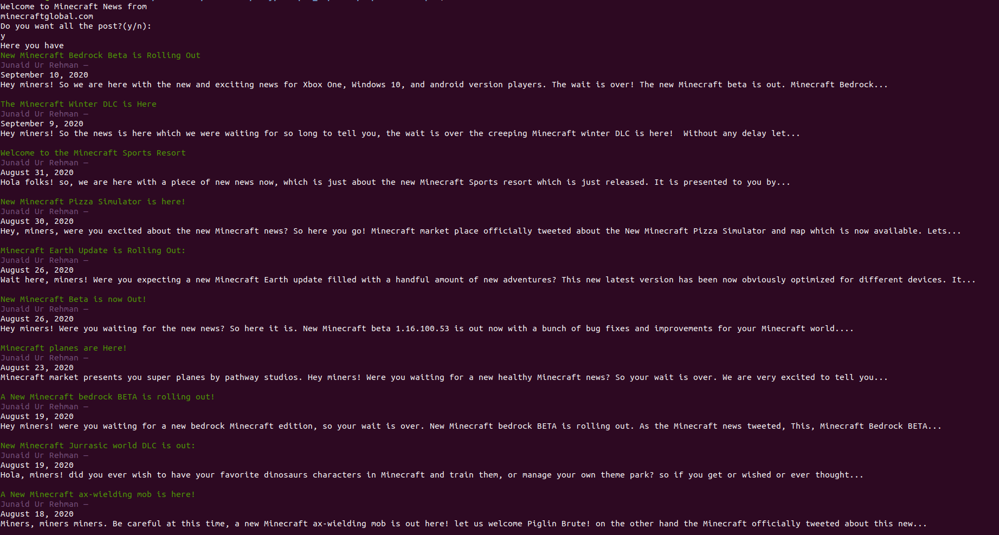

# Minecraft News Scraper
- This project:
  - Scrap the web page https://www.minecraftglobal.com and return the news about Minecraft in a user-friendly way

- In this project I:
  - Create different files for the different classes
  - Test the public classes

- This project was created because as a Minecraft player I like to have easy access to the news about that game
 

# How it works

- The Scraper will return the news(post) from https://www.minecraftglobal.com depending on your anwsers (y or n) displaying it in the terminal

## Built with

- Ruby
- nokogiri
- open-uri
- rainbow

## Live Demo

[Click for live webpage](https://repl.it/@RicardoMonteneg/main#main.rb)

## Getting Started

- Clone or download the repository

- For Linux Users (Ubuntu):
    - In the folder that contains the cloned repository, "Capstone-Scraper", right-click.
    - Click in the option Open in Terminal (this will open the Terminal)
    - In the Terminal run main

## Testing

- For Testing:

    - Open the folder "Capstone-Scraper".
    - from that folder open the terminal.
    - in the terminal run Bundle install
    - and finally in the terminal run rspec.

## Author 1

- Github: [@ricardomonte](https://github.com/ricardomonte)
- Twitter: [@ramnkco](https://twitter.com/ramnkco)
- LinkedIn: [Ricardo Montenegro](https://www.linkedin.com/in/ricardo-antonio-montenegro-nu%C3%B1ez-87a74944/)

## 🤝 Contributing

Contributions, issues and feature requests are welcome! Start by:

- Forking the project
- Cloning the project to your local machine
- `cd` into the project directory
- Run `git checkout -b your-branch-name`
- Make your contributions
- Push your branch up to your forked repository
- Open a Pull Request with a detailed description to the development branch of the original project for a review

## Show your support

Give a ⭐️ if you like this project

##  :memo: License

This project is [MIT](LICENSE) licensed.